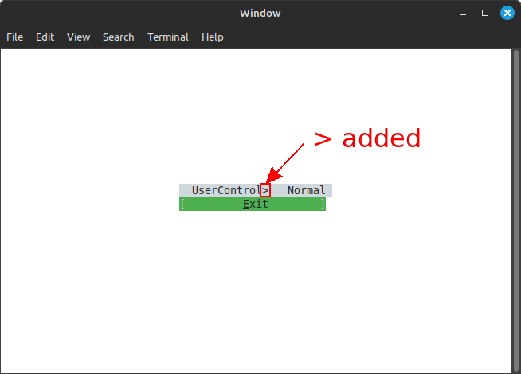
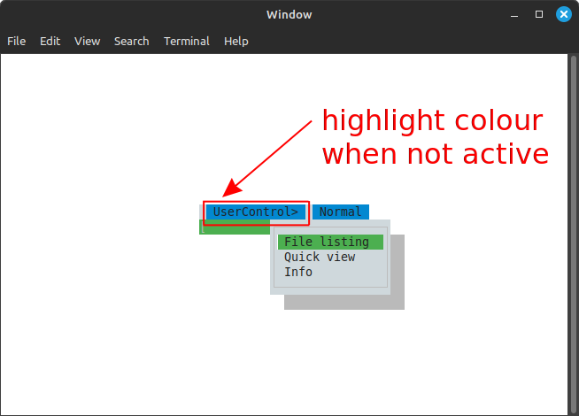
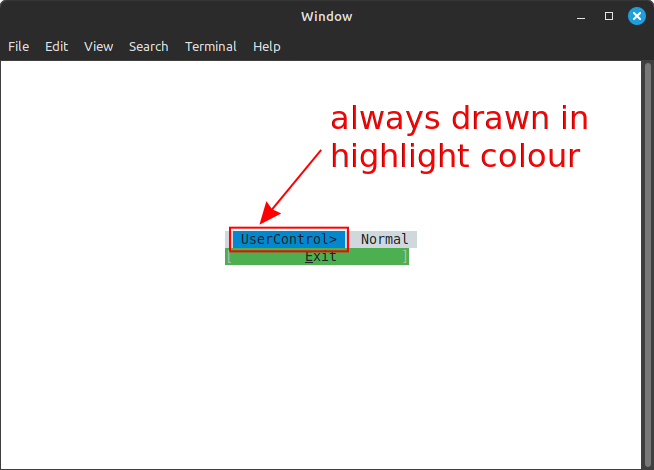

# Consolonia Menu Test
Test app to show menu being incorrectly rendered


## Pre-requisites
*   .NET SDK 9


## Getting started
```bash
# clone repo
git clone https://github.com/TrevorDArcyEvans/ConMenuTest.git

# build
cd ConMenuTest
dotnet build

# run app
dotnet run
```

## MenuItem added as a UserControl rendered with extra character

<details>

* _Consolonia_ Version="11.2.*-beta.*"
* platform: _Linux Mint 21.2_
* .NET 9.0.102

### Steps to reproduce
1. run app

**Observed result**
* `UserControl` menu is rendered with a trailing `>` symbol
* 
* note that `UserControl` is rendered in control colour (grey)

**Expected result**
* `UserControl` menu should be rendered without extra characters

</details>


## MenuItem added as UserControl is always highlighted after being accessed

<details>

* _Consolonia_ Version="11.2.*-beta.*"
* platform: _Linux Mint 21.2_
* .NET 9.0.102

### Steps to reproduce
1. run app
2. dropdown `UserControl` menu
3. dropdown `Normal` menu

**Observed result**
* 
* `UserControl` menu is rendered in highlight colour (blue)

**Expected result**
* `UserControl` menu should be rendered in control colour (grey)

4. tab away from `Normal` menu

**Observed result**
* 
* `UserControl` menu is always rendered in highlight colour (blue)

**Expected result**
* `UserControl` menu should be rendered in control colour (grey) when not highlighted

</details>

